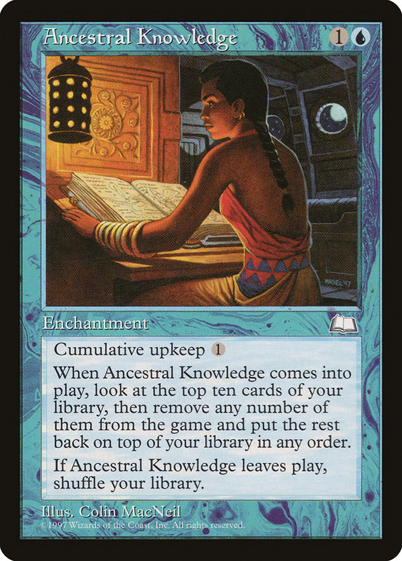

# Ancestral Knowledge


<div align="center">

</div>

```bash
docker compose up -d

docker logs bookstack
docker logs bookstack_db

docker compose down

```

## Credenciais padrão do BookStack:


Email: admin@admin.com

Senha: password

> [! IMPORTANT]
> Assim que entrar, vá em:

1) Settings (configurações) no canto superior direito
2) Troque o email e a senha do admin
3) Crie seu usuário próprio


## API
serve para integrar e automatizar o gerenciamento de documentação

```bash
curl -H "Authorization: Token seu_token_aqui:seu_secret_aqui" \
     http://localhost:6875/api/books

```


```bash
# Listar todos os livros
GET http://localhost:6875/api/books

# Listar todas as páginas
GET http://localhost:6875/api/pages

# Listar capítulos
GET http://localhost:6875/api/chapters

# Listar shelves (estantes)
GET http://localhost:6875/api/shelves

# Buscar conteúdo
GET http://localhost:6875/api/search?query=termo

# Criar um livro (POST)
POST http://localhost:6875/api/books


```


## WEBHOOK

notificar eventos

http://localhost:6875/settings/webhooks

Criar novo webhook:

1) Clique em "Create New Webhook"

2) Cole a URL de destino (ex: https://seu-servidor.com/webhook


Para testar localmente, use:

- webhook.site - https://webhook.site (gera URL temporária)

- ngrok - expõe sua máquina local

Formato do payload:

```json
{
  "event": "page_create",
  "text": "Page created",
  "triggered_at": "2025-11-07T01:45:00.000000Z",
  "triggered_by": {...},
  "webhook_id": 1,
  "webhook_name": "Meu Webhook",
  "url": "http://localhost:6875/books/...",
  "related_item": {...}
}

```
